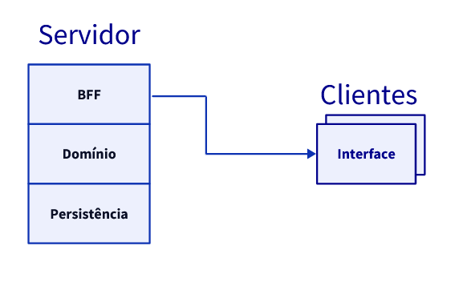

# Laboratório 2

## Dicionário Remoto - Arquitetura

A aplicação de **dicionário remoto** será constituída de **quatro** componentes:

- **Persistência** - Responsável por persistir em disco os dados que foram registrados durante a atividade do servidor.
- **Domínio** - Responsável pela lógica de negócio da aplicação: servir como dicionário. A ideia é que esta camada esteja desacoplada das outras duas camadas.
- **Aplicação** - Responsável por expor métodos prontos para o consumo pelos clientes e uma interface administrativa para o servidor.
- **Interface** - A interface será responsável por requisitar os serviços expostos pelo servidor e exibi-los ao usuário.

A proposta da solução é que a camada de **domínio** exponha **interfaces** para as camadas de **persistência** e **aplicação**. Dessa forma, as interfaces descrevem o que a aplicação deve fazer, e contanto que as demais camadas do servidor a implementem, elas podem ser utilizadas. 

Através dessa proposta, **reduzimos o acoplamento entre a aplicação e a persistência**, permitindo que facilmente sejam trocadas, contanto que satisfaçam as nossas regras de negócio, descritas pelas interfaces do domínio.

Detalhes acerca da implementação do **Servidor** e do **Cliente** estarão em seus respectivos diretérios.