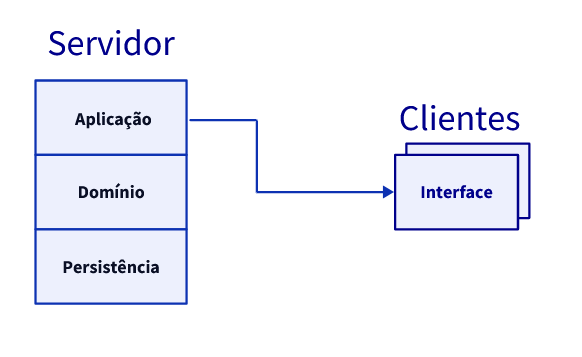

# Laboratório 2

## Dicionário Remoto - Arquitetura de Software e Sistema

A aplicação de **dicionário remoto** será constituída de **quatro** componentes em sua Arquitetura de Software, seguindo um **estilo arquitetural em camadas**:

- **Persistência** - Responsável por persistir em disco os dados que foram registrados durante a atividade do servidor. 
- **Domínio** - Responsável pela lógica de negócio da aplicação: servir como dicionário. A ideia é que esta camada esteja desacoplada das outras duas camadas e exponha uma interface para a implementação da persistência e exponha um serviço para a camada de aplicação.
- **Aplicação** - Responsável por expor métodos prontos para o consumo pelos clientes e uma interface administrativa para o servidor.
- **Interface** - A interface será responsável por requisitar os serviços expostos pelo servidor e exibi-los ao usuário.

A proposta é que cada um desses componentes se comunique da camada mais próxima ao cliente até a camada mais profunda do servidor - O usuário fará uma requisição ao servidor, que responderá com os métodos expostos da chamada de aplicação, que invocarão os serviços do domínio, que expõe uma interface de persistência para ser implementada em sua respectiva camada.

Através dessa proposta, **reduzimos o acoplamento entre a aplicação e a persistência**, permitindo que facilmente sejam trocadas, contanto que satisfaçam as nossas regras de negócio, descritas pelas interfaces do domínio.

A arquitetura de software poderá ser instanciada em uma arquitetura de sistema cliente/servidor de maneira centralizada, da seguinte maneira:



Separamos, do lado do cliente, a camada de interface, e do lado do servidor, as camadas de Aplicação, Domínio e Persistência.

Detalhes acerca da implementação do **Servidor** e do **Cliente** estarão em seus respectivos diretérios.

Comum tanto ao **Servidor** quanto ao **Cliente**, é o módulo de criação de mensagens, presente na pasta de ```Comunicacao```.
Esse módulo foi criado com a finalidade de proporcionar ao cliente e ao servidor uma maneira de criar mensagens que seguem um padrão específico para a comunicação - e a ideia é que essa comunicação fosse minimamente genérica e não somente restrita a essa aplicação de dicionário, sendo possível fazer chamadas de ```get```, ```post```, ```delete``` e ```action```. Mais detalhes acerca da comunicação estarão também presentes em seu respectivo diretório.